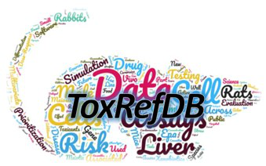

<!-- README.md is generated from README.Rmd. Please edit that file -->

```{r, echo = FALSE}
knitr::opts_chunk$set(
  collapse = TRUE,
  comment = "#>",
  fig.path = "man/figures/README-"
)
```

# Toxicity Reference Database (ToxRefDB)

## Overview

<a href="https://www.epa.gov/comptox-tools/downloadable-computational-toxicology-data#AT"></a>

The Toxicity Reference Database (ToxRefDB) serves as a resource for structured animal toxicity data for many retrospective and predictive toxicology applications. ToxRefDB contains in vivo study data from over 6000 guideline or guideline-like human health relevant studies for over 1000 chemicals. The goal of ToxRefDB is to provide a public database that better supports the needs of predictive toxicology by increasing the qualitative and quantitative information available and by facilitating the interoperability of legacy in vivo hazard information with other tools and databases.

### History

The first version of ToxRefDB (ToxRefDB v1.0) was initially released as a series of spreadsheets, which are still available on EPA’s FTP site and referenced in FigShare (https://doi.org/10.23645/epacomptox.6062545.v1). ToxRefDB underwent significant updates, including extraction of quantitative (i.e. dose-response) data, that  that are described in [Watford et al.(2019)](https://doi.org/10.1016/j.reprotox.2019.07.012) and was released as ToxRefDB v2.0. ToxRefDB v2.0 and its associated summary files can be found here: https://doi.org/10.23645/epacomptox.6062545.v3. 

ToxRefDB v2.1 represented a minor update of ToxRefDB v2.0 to address issues discovered with the compilation script that caused some extracted values, notably toxicity effects, not to import properly from the original MS AccessDB curation files, such as failure to import some effects. Although the overall total number of studies and chemicals remained unchanged, the v2.1 update included additional data as previously curated studies with extracted dose treatment groups and effects were made fully accessible. The additional data improved the utility of ToxRefDB as a resource for curated legacy in vivo information by providing more complete information of the past animal studies conducted. The minor update was described in the [Feshuk et al. (2023)](https://www.frontiersin.org/articles/10.3389/ftox.2023.1260305/full) publication, and ToxRefDB v2.1 and its associated summary files can be found here: https://doi.org/10.23645/epacomptox.6062545.v4. 

### Summary of ToxRefDB v3.0

ToxRefDB v3.0 contains summary information from 6341 guideline or guideline-like human health relevant studies for over 1228. The quantitative (i.e. dose-response) data has now been completed for 4320 studies (indicated with processed=TRUE) with plans to extract and release the remaining data in subsequent database versions.

ToxRefDB v3.0 represents the next iteration of the ToxRefDB project featuring several key updates:

* Improved Curation Workflow: New data in ToxRefDB v3.0 was curated using an application-driven workflow. The Data Collection Tool (DCT), an Oracle APEX software, was developed and utilized to support continued curation efforts. In the future, Health Assessment Workspace Collaborative (HAWC) is anticipated to be leveraged to support ToxRefDB curation, data access, and visualization.
* Vocabulary Expansion for New Study Type: Expanded controlled vocabulary and a new guideline profile was curated to capture the OPPTS 870.6300 developmental neurotoxicity (DNT) guideline and “non-guideline” studies.
* MySQL –> PostgreSQL Migration: The database was migrated from MySQL into PostgreSQL format.
* New Study Extractions: Data extraction from source documents (e.g. OPP DERs and NTP PFAS reports (TOX-96 and TOX-97)) expanded both the chemical and study coverage of ToxRefDB.
* Improved Data Provenance: Source chemical information was added as new JSON column with confirmed DSSTox Substance Identifiers (DTXSIDs) mappings stored in the chemical table.
* Improved Citation Management: NTP source report identifiers were added as ToxRefDB study source ids. Efforts are underway to expand Health and Environmental Research Online database (HERO) interoperability for improved citation management.
* Quality Control: Quality assurance, such as vocabulary standardization to continue to provide more detailed effect and study-level information allowing for a more streamlined, interoperable database efforts. Errors were identified for systematic correction, such as non-standard values in free-text fields and effect size comparisons to flag poorly extracted data.

## Usage

This repository was updated to serve ToxRefDB v3.0, however past versions are also available. Visit [Clowder](https://clowder.edap-cluster.com/datasets/61147fefe4b0856fdc65639b#folderId=6850327be4b096bca8848301) to download the complete database release package, including the referenced files below:

* toxrefdb_3_0_user_guide.pdf: This file provides information about the database development, database contents, data dictionary for all tables and fields, and example queries to extract information from the database.
* toxrefdb_3_0_release_note.html: This interactive .html report summarizes and explores data available in ToxRefDB v3.0.
* toxrefdb_3_0_study_chemical_summary.xlsx: This .xlsx summary flat file provides study and chemical metadata for all curated information in ToxRefDB v3.0. This file can be useful for understanding the chemical and study coverage of the current database. Chemical and study tables were joined to create this file.
* toxrefdb_3_0_erd.png: This .png file visualizes the entity relation diagram (ERD) for the ToxRefDB v3.0 database schema. Users may find this file helpful for understanding joins and foreign key constraints to extract information from ToxRefDB v3.0. Consider reviewing the user guide for example SQL queries.
* toxrefdb_3_0.sql: The .sql dump file of the entire v3.0 database is available. ToxRefDB v3.0 is a generic SQL export, therefore can effectively bridge the gap between different database GUIs. Install instructions and example queries for the PostgreSQL format are in scope of the user guide.
* toxrefdb_3_0_pod.csv: This .csv flat file presents summary-level point of departure values for all ToxRefDB studies indicated with processed=TRUE.

This repository also includes the following scripts relevant to ToxRefDB v3.0: 

* [generate_toxref_pod.R](scripts/generate_toxref_pod.R): ToxRefDB information is summarized with calculated point-of-departure (POD) values for inclusion in the Toxicity Values Database (ToxValDB), which is accessible via the [CompTox Chemicals Dashboard](http://comptox.epa.gov/dashboard). The following POD types were derived based on the extracted effect data: the Lowest Effect Level (LEL: the lowest dose with observed treatment-related effects), the Lowest Observed Adverse Effect Level (LOAEL: the lowest dose with observed critical effect), the No Effect Level (NEL: the highest dose with no observed effects, as inferred from LEL), and the No Observed Adverse Effect Level (NOAEL: the highest dose with no observed critical effects, as inferred from LOAEL), where “treatment-related” indicates the effects were statistically significant from the control and “critical” indicates that effects were considered adverse by toxicologist reviews of the study findings. POD groupings are defined as a concatenation of study_id and study_type if no effects are extracted, else a concatenation of study_id, life_stage, generation, sex, and endpoint_category. Some study types will have required treatment groupings by sex, lifestage, and generations that will be filled by the highest concentration tested if no effects were observed. This script was used to populate the pod table, which is provided for convenience as toxrefdb_3_0_pod.csv. 
* [generate_toxref_negative_endpoints_negative_effects.R](scripts/generate_toxref_negative_endpoints_negative_effects.R): Negative endpoints and effects are inferred from guideline profiles and the testing and reporting statuses of endpoints. This script was used to populate the negative endpoints and effects for the negative_endpoint and negative_effects tables, respectively.
  
If you would like to report a bug or have other questions related to ToxRefDB, please contact Madison Feshuk, [feshuk.madison@epa.gov](mailto:feshuk.madison@epa.gov).

## Disclaimer

The United States Environmental Protection Agency (EPA) GitHub project code is provided on an "as is" basis and the user assumes responsibility for its use. EPA has relinquished control of the information and no longer has responsibility to protect the integrity, confidentiality, or availability of the information. Any reference to specific commercial products, processes, or services by service mark, trademark, manufacturer, or otherwise, does not constitute or imply their endorsement, recommendation or favoring by EPA. The EPA seal and logo shall not be used in any manner to imply endorsement of any commercial product or activity by EPA or the United States Government.